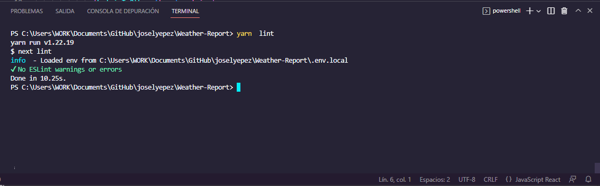

<!-- PROJECT SHIELDS -->
[![Forks][forks-shield]][forks-url]
[![Stargazers][stars-shield]][stars-url]
[![Issues-open][issues-open-shield]][issues-url]
[![Issues-closed][issues-closed-shield]][issues-url]
[![Contributors][contributors-shield]][contributors-url]
[![contributions welcome][contributions-welcome]][issues-url]

<!-- PROJECT LOGO -->
<br />
<p align="center">
  <a href="https://openweathermap.org/">
    
  </a>

  <h1 align="center">
	Weather Report webpage
  </h1>

  <p align="center">
    Dynamically rendering a simple weather homepage using async JS
    <br />
	  🖊️
    <a href="https://www.theodinproject.com/courses/javascript/lessons/weather-app">Assignment</a>
    🐞
    <a href="https://github.com/Israel-Laguan/Weather-Report/issues">Report a Bug</a>
    🙋‍♂️
    <a href="https://github.com/Israel-Laguan/Weather-Report/issues">Request Feature</a>
  </p>
</p>

[](http://weather-report-israellaguan.vercel.app/)

# The Project

Your city's weather info, one click away, is just awaiting for you! Powered by [OpenWeather API][openweather].

For Microverse based in these [requirements](https://www.theodinproject.com/courses/javascript/lessons/weather-app).

- Async calls to external server
- Data Structures
- Object Oriented Programming
- Factory Functions
- Single Responsibility
- Tightly Coupled Objects
- Module Pattern
- ES6 syntax
- Export/import ES6+ notation
- Linters

# Features

[![][javascript]][javascript-url] 
[![][react]][next.js-url] 
[![][next.js]][javascript-url] 
[![][tailwindCss]][tailwindCss-url] 
![eslint][]

- Next.js
- React
- TailwindCss
- Next.js-Create-App
- JS modules and ES6+ available for most browsers
- Connected an API using `async/await`
- Sets `stickler` on the repo
- Sets `eslint` rules
- Tests made with [`ESLint`](https://eslint.org/)
- And `jest` and `eslint` to be callable with `yarn`


# Tests

## `ESlint`



# Built With

- Next.js
- `ESLint`
- `yarn`
- `vscode` with _ESLint_ extension
- Linux/GNU
- Love and Passion for code

# Build

# Live Demo

[](http://weather-report-israellaguan.vercel.app/)

### Try the autocomplete feature!


## Prerequisites

- `yarn` 1.22 +
- `node` 16.17.1 +
- A Text Editor like VSCode
- A browser like Firefox or Chrome

## Quick Start

```
> git clone https://github.com/Israel-Laguan/Weather-Report.git
> cd Weather-Report
> yarn install
> yarn dev
```

Then open [http://localhost:3000/](http://localhost:3000/) to see the app.

### Run development build

- `yarn dev`
Runs the app in the development mode. Open localhost:3000 to view it in the browser.

The page will reload if you make edits. You will also see any lint errors in the console.

## Production

- `yarn build` 
Generates an optimized version of your application for production. to prepare `HTMLL`, `CSS`, `JS` 
This output is generated inside the /next folder.

## Run tests

Optionally you can run the linter and tests: `yarn lint`

### Learn More

#### Next

[Next](https://nextjs.org) gives you the best developer experience with all the features you need for production: hybrid static & server rendering, TypeScript support, smart bundling, route pre-fetching, and more. No config needed.

#### React

[React](https://reactjs.org/) is a JavaScript library for building user interfaces.

- Component-Based:
Build encapsulated components that manage their own state, then compose them to make complex UIs.

- Declarative:
React makes it painless to create interactive UIs. Design simple views for each state in your.

- Learn Once, Write Anywhere:
We don’t make assumptions about the rest of your technology stack, so you can develop new features in React without rewriting existing code.

#### Tailwind CSS

[Tailwind CSS](https://tailwindcss.com/) is modern utility-first CSS framework. It provides many CSS rules, but these are purged when production builds. So developers do not worry about CSS asset size for performance optimization.


# Author

<table style="width:100%">
  <tr>
    <td>
        <div align="center">
            <a href="./docs/img/photo.png" target="_blank" rel="author">
                
            </a>
            <h2>
                <a href="https://israel-laguan.github.io/" target="_blank" rel="author">
                    Israel Laguan
                </a>
            </h2>
        </div>
    </td>
    <td>
        <div align="center">
            <a href="mailto:israellaguan@gmail.com" target="_blank" rel="author">
                
                <h3>
                    Email me to 
                    <a href="mailto:israellaguan@gmail.com">
                        israellaguan@gmail.com
                    </a>
                </h3>
            </a>
            <a href="https://www.linkedin.com/in/israellaguan/" target="_blank" rel="author">
                
                <h3>
                    Connect to my Linkedin
                </h3>
            </a>
            <a href="https://github.com/Israel-Laguan" target="_blank" rel="author">
                
                <h3>
                    Check my GitHub Profile
                </h3>
            </a>
        </div>
    </td>
  </tr>
</table> 

# Contributing

[![contributions welcome][contributions-welcome]][issues-url]

🤝 Contributions, issues and feature requests are welcome!
Feel free to check the [issues page][issues-url].


# 🤗 Show your support

Give a ⭐️ if you like this project!

# 🏅 Acknowledgements

- [Microverse](https://www.microverse.org/)
- [The Odin Project](https://www.theodinproject.com/)
- [Readme header author](https://github.com/collinsugwu/Microverse201-Enumerable-Methods)
- [FlatIcon](https://www.flaticon.com/) images
- [OpenWeatherMap](https://openweathermap.org/) API

# License

[![License][badge-license]](http://badges.mit-license.org)

📝 This project is licensed under the [MIT](LICENSE)\
Feel free to fork this project and improve it

<!-- MARKDOWN LINKS & IMAGES -->
[contributors-shield]: https://img.shields.io/github/contributors/Israel-Laguan/Weather-Report?style=for-the-badge
[contributors-url]: https://github.com/Israel-Laguan/Weather-Report/graphs/contributors
[forks-shield]: https://img.shields.io/github/forks/Israel-Laguan/Weather-Report?style=for-the-badge
[forks-url]: https://github.com/Israel-Laguan/Weather-Report/network/members
[stars-shield]: https://img.shields.io/github/stars/Israel-Laguan/Weather-Report?style=for-the-badge
[stars-url]: https://github.com/Israel-Laguan/Weather-Report/stargazers
[issues-open-shield]: https://img.shields.io/github/issues/Israel-Laguan/Weather-Report?style=for-the-badge
[issues-closed-shield]: https://img.shields.io/github/issues-closed/Israel-Laguan/Weather-Report?style=for-the-badge
[issues-url]: https://github.com/Israel-Laguan/Weather-Report/issues
[contributions-welcome]: https://img.shields.io/badge/contributions-welcome-brightgreen.svg?style=for-the-badge
[badge-license]: https://img.shields.io/:license-mit-blue.svg?style=for-the-badge
[javascript]: https://img.shields.io/badge/JAVASCRIPT-ES6%2B-F7DF1E?style=for-the-badge&logo=javascript
[react]: https://img.shields.io/badge/React-16+-61DAFB?style=for-the-badge&logo=react
[eslint]: https://img.shields.io/badge/linter-ESLint-4B32C3?style=for-the-badge&logo=eslint
[next.js]: https://img.shields.io/badge/NEXT.JS-V13-000000?style=for-the-badge&logo=next.js
[tailwindCss]: https://img.shields.io/badge/tailwindcss-V3.2.1-9cf?style=for-the-badge&logo=tailwindcss
[openweather]: https://openweathermap.org/
[javascript-url]: https://developer.mozilla.org/en-US/docs/Web/JavaScript
[react-url]: https://reactjs.org/
[next.js-url]: https://nextjs.org/
[tailwindCss-url]: https://tailwindcss.com/
