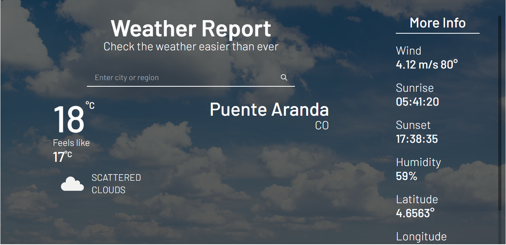
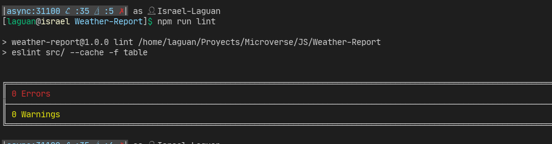
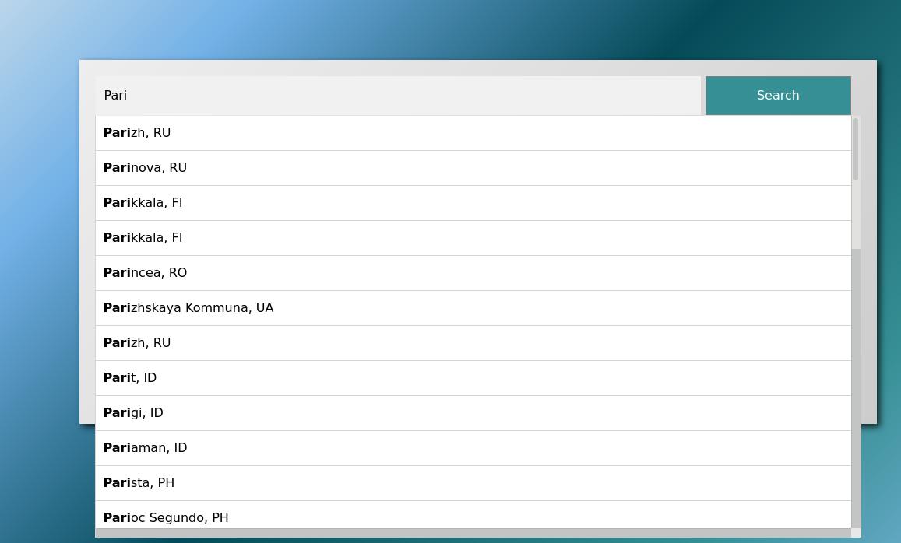

<!-- PROJECT SHIELDS -->
[![Contributors][contributors-shield]][contributors-url]
[![Forks][forks-shield]][forks-url]
[![Stargazers][stars-shield]][stars-url]
[![Issues-open][issues-open-shield]][issues-open-url]
[![Issues-closed][issues-closed-shield]][issues-closed-url]

<!-- PROJECT LOGO -->
<br />
<p align="center">
  <a href="https://www.microverse.org/">
    
  </a>

  <h1 align="center">
	Weather Report webpage
  </h1>

  <p align="center">
    Dynamically rendering a simple weather homepage using async JS
    <br />
	  🖊️
    <a href="https://www.theodinproject.com/courses/javascript/lessons/restaurant-page">Assignment</a>
    🐞
    <a href="https://github.com/Israel-Laguan/Weather-Report/issues">Report a Bug</a>
    🙋‍♂️
    <a href="https://github.com/Israel-Laguan/Weather-Report/issues">Request Feature</a>
  </p>
</p>

[](http://weather_report.surge.sh/)

# The Project

Your city's weather info, one click away, is just awaiting for you!

For Microverse based in these [requirements](https://www.theodinproject.com/courses/javascript/lessons/weather-app).

- Async calls to external server
- Data Structures
- Object Oriented Programming
- Factory Functions
- Single Responsibility
- Tightly Coupled Objects
- Module Pattern
- ES6 syntax
- Export/import ES6+ notation
- Linters

# Features

- Basic VanillaJS app with a single script or few commands
- JS modules and ES6+ available for most browsers
- Sets `stickler` on the repo
- Sets `eslint` rules
- Tests made with [`ESLint`](https://eslint.org/)
- Unit Testing with [`Jest`](https://jestjs.io/)
- Add `jest` and `eslint` to be callable with `npm`


# Tests

## `ESlint`



# Built With

- Webpack
- `ESLint`
- `npm`
- `vscode` with _ESLint_ extension
- Linux/GNU
- Love and Passion for code

# Build

# Live Demo

[](http://weather_report.surge.sh/)

### Try the autocomplete feature!



## Prerequisites

- `npm` 6.13 +
- `node` 11.15 +
- A Text Editor like VSCode
- A browser like Firefox or Chrome

## Quick Start

```
git clone https://github.com/Israel-Laguan/Weather-Report.git
cd Weather-Report
npm i && npm start
```

Then open [http://localhost:3000/](http://localhost:3000/) to see the app.

### Where are generated files?

In `development` mode `webpack` does not write generated files to disk, in order to change it
switch `devServer.writeToDisk` to `true` in [webpack.dev.js](./webpack.common.config.js). The generated files are
on `dist/` folder.

### Run development build

- `npm start`

## Production

- `npm run build` to prepare `html`, `css`, `js` files in `dist/` directory

## Run tests

Optionally you can run the linter and tests: `npm run linter && npm test`

# 👨 Author

- [Israel Laguan](https://github.com/Israel-Laguan)

# 🤝 Contributing

Contributions, issues and feature requests are welcome!
Feel free to check the [issues page](https://github.com/Israel-Laguan/Weather-Report/issues).

# 🤗 Show your support

Give a ⭐️ if you like this project!

# 🏅 Acknowledgements

- [Microverse](https://www.microverse.org/)
- [The Odin Project](https://www.theodinproject.com/)
- [Readme header author](https://github.com/collinsugwu/Microverse201-Enumerable-Methods)
- [FlatIcon](https://www.flaticon.com/) images
- [OpenWeatherMap](https://openweathermap.org/) API

# 📝 License

This project is licensed under the [MIT](LICENSE)\
Feel free to fork this project and improve it

<!-- MARKDOWN LINKS & IMAGES -->
[contributors-shield]: https://img.shields.io/github/contributors/Israel-Laguan/Weather-Report?style=plastic
[contributors-url]: https://github.com/Israel-Laguan/Weather-Report/graphs/contributors
[forks-shield]: https://img.shields.io/github/forks/Israel-Laguan/Weather-Report?style=plastic
[forks-url]: https://github.com/Israel-Laguan/Weather-Report/network/members
[stars-shield]: https://img.shields.io/github/stars/Israel-Laguan/Weather-Report?style=plastic
[stars-url]: https://github.com/Israel-Laguan/Weather-Report/stargazers
[issues-open-shield]: https://img.shields.io/github/issues/Israel-Laguan/Weather-Report?style=plastic
[issues-closed-url]: https://github.com/Israel-Laguan/Weather-Report/issues
[issues-closed-shield]: https://img.shields.io/github/issues-closed/Israel-Laguan/Weather-Report?style=plastic
[issues-open-url]: https://github.com/Israel-Laguan/Weather-Report/issues